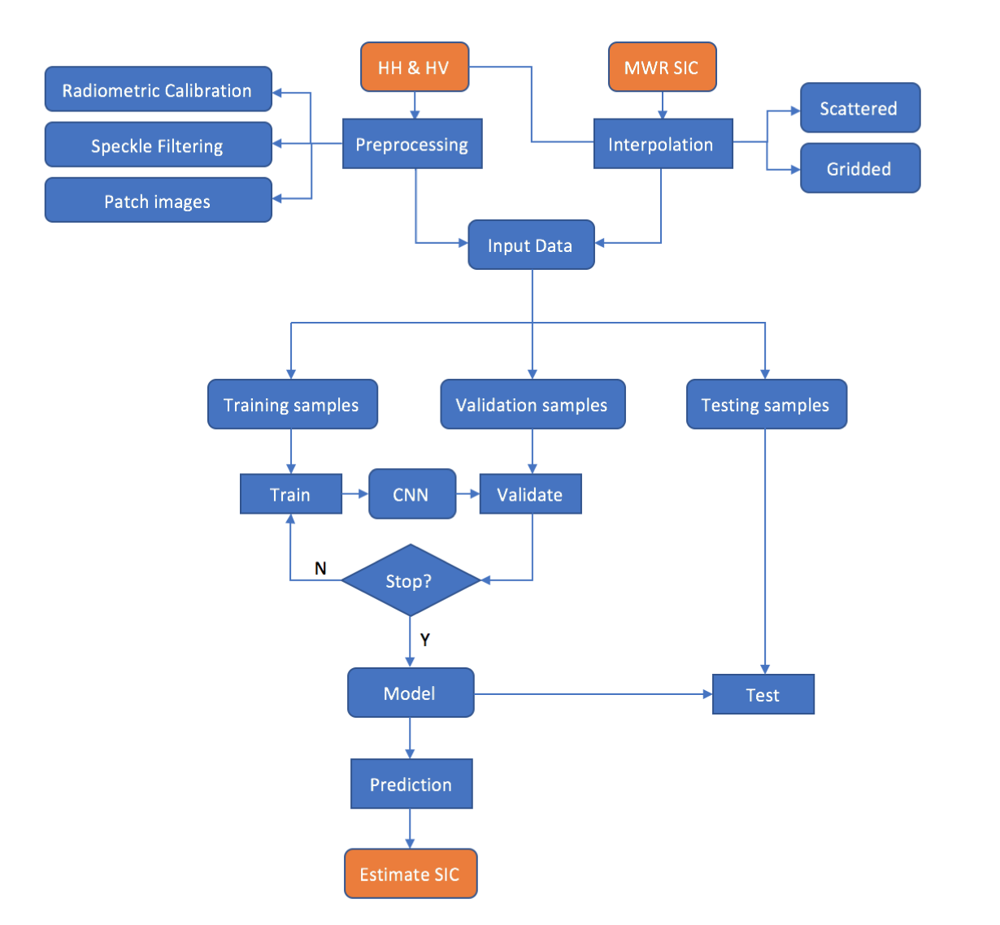
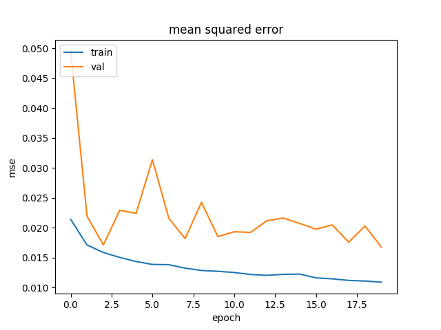

Methods
======================

Flow Chart
---------------

The whole process of the project is shown in the flow chart.

Basically includes the following steps:

1. Preprocessing of the PolSAR data and MWR SIC products

    a. Radiometer calibration, speckle filter of the PolSAR data
    b. SAR HH polarization incidence angle correction (optional)

      .. figure:: ./images/incidence_angle.png
          :width: 550px
          :align: center

    c. Up-sampling of SIC products to 2km spatial resolution
    d. Reprojection and geo-registration of samples
    e. Data augmentation and normalization

#. Generating training samples and put into CNN model

    .. figure:: ./images/CNN_flow.png
        :width: 600px
        :align: center

    The training samples will go through Conv.layer, Non-linear activation function ReLU,
    Max.pooling layer and fully connected layer. Finally, CNN model will estimate a SIC value (float between 0-1) for each input sample.
    The convolutional operation will learn complex and representation image features (border, curve and high levels of abstraction).

#. Tune model according to the training and validation curve and test model generalization ability (test samples)

    .. csv-table:: CNN architecture
       :header: "Process", "Parameters", "Description"
       :widths: 20, 20, 40

       Input,(50 50 2),Input patches size
       Conv2D,(32 3 3 2),Number of filters and filter size
       BatchNorm, ,Accelerate convergence
       Activation,ReLU,Activation function
       Conv2D,(32 3 3 2),Number of filters and filter size
       BatchNorm, ,Accelerate convergence
       Activation,ReLU,Activation function
       MaxPooling2D,(2 2),Pooling window size
       Dropout,0.25,Fraction of the input units to drop
        , ,
       Conv2D,(64 3 3 2),Number of filters and filter size
       BatchNorm, ,Accelerate convergence
       Activation,ReLU,Activation function
       Conv2D,(64 3 3 2),Number of filters and filter size
       BatchNorm, ,Accelerate convergence
       Activation,ReLU,Activation function
       MaxPooling2D,(2 2),Pooling window size
       Dropout,0.25,Fraction of the input units to drop
        , ,
       Conv2D,(64 3 3 2),Number of filters and filter size
       BatchNorm, ,Accelerate convergence
       Activation,ReLU,Activation function
       Conv2D,(64 3 3 2),Number of filters and filter size
       BatchNorm, ,Accelerate convergence
       Activation,ReLU,Activation function
       MaxPooling2D,(2 2),Pooling window size
       Dropout,0.25,Fraction of the input units to drop
        , ,
       Conv2D,(128 3 3 2),Number of filters and filter size
       BatchNorm, ,Accelerate convergence
       Activation,ReLU,Activation function
       Conv2D,(12 3 3 2),Number of filters and filter size
       BatchNorm, ,Accelerate convergence
       Activation,ReLU,Activation function
       MaxPooling2D,(2 2),Pooling window size
       Dropout,0.25,Fraction of the input units to drop
        , ,
       Dense,1024,Fully connected layer size
       Activation,ReLU,Activation function
       Dense,1,Fully connected layer size
       Activation,Linear,Activation function

Finally, I learned from VGG architecture and introduced batchnormalization into the network.
Low dropout rate strengthens the regularization effect. Deeper network (8 conv layers compared with original 6)
increases validation accuracy and solve some part of misclassification of sea ice.

Loss curve
------------------------

Based on training and validation loss curve. After 20 epochs, both training and validation
losses don't change much. These curves indicate that model well learn the features of training samples
rather than obvious underfitting or overfitting.

