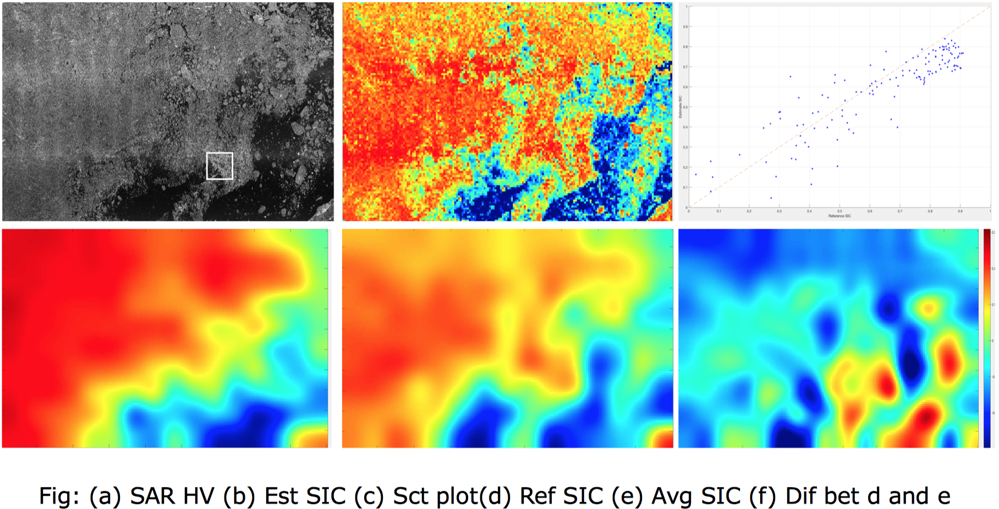

Result
=================

Sea ice concentration is a value between 0 to 1. Therefore, we used the regression model
performance evaluation metrics: mean error(E\ :sub:`sgn`\), mean absolute error(E\ :sub:`L1`\),
standard deviation(E\ :sub:`std`\) and root mean squared error(E\ :sub:`rmse`\).

The final error of each sample is shown in the table:

.. csv-table:: Error statistic
   :header: "Set", "Date", "E_sgn","E_L1","E_std","E_rmse"
   :widths: 15, 10, 10, 10, 10, 10

   Training,160711,-0.0370,0.0822,0.1260,0.1313
   Training,160712,-0.0061,0.0820,0.1383,0.1384
   Training,160714,-0.0167,0.0296,0.0829,0.0846
   Training,160715,0.0129,0.0744,0.1314,0.1320
   Training,160716,-0.0338,0.0697,0.1183,0.1230
   Training,160723,-0.0266,0.0723,0.1369,0.1395
   Training,160724,-0.0085,0.0732,0.1298,0.1301
   Training,160726,-0.0005,0.0368,0.0970,0.0971
   Training,Average,-0.0145,0.0650,0.1201,0.1220
    , , , , ,
   Validation,160727,0.0374,0.0993,0.1617,0.1660
   Validation,160705,-0.0735,0.1394,0.1676,0.1830
   Validation,Average,-0.0181,0.1194,0.1647,0.1745
    , , , , ,
   Test,160706,-0.0569,0.1393,0.1704,0.1796
   Test,160722,-0.0305,0.1292,0.1814,0.1839
   Test,Average,-0.0437,0.1343,0.1759,0.1818

Minus E\ :sub:`sgn`\ means compared to SIC product, CNN model had underestimation of sea ice concentration
in prediction results.
Some datasets with quite low E\ :sub:`rmse`\ in training are occupied with a large open water area.

Abbreviations
----------------------
The table helps to explain the abbreviations in the following results:

.. csv-table:: Abbreviations
   :header: "Abb", "Full", "Explanation"
   :widths: 15, 20, 30

   Est SIC,Estimate SIC,prediction result from CNN model
   Ref SIC,Reference SIC,MWR SIC product (ground truth)
   Avg SIC,Average SIC,Average of Est SIC to compared with Ref SIC

Training dataset
-----------------------------

Training dataset 160712 is a very good example of showing the competence of the CNN model.
As shown in the figure, the result demonstrates that the model can deal with incidence angle effect
in SAR HH image and banding effect in SAR HV image.

.. figure:: ./images/t160712.png
    :width: 650px
    :align: center

    Training, 160712

.. note:: The range of colorbar in f (difference between ground truth and prediction) and that in others is not the same.

          1. colorbar in difference figure range from -0.3 to 0.3
          #. colorbar in Est SIC, Ref SIC and Avg SIC range from 0 to 1
          #. The rest of the figures follow the same rules

Zoom into the rectangle area of the last image, more details show how good performance of the model
in a water ice mixed area, even though the input HH image is seriously affected by incidence angle
dependence effect (Fig a).

.. figure:: ./images/ts160712.png
    :width: 650px
    :align: center

    Training subsets, 160712

Deeper CNN network could effectively scrap the scalloping noise in HV image (Fig b and c). However,
the cost was some misclassification at low backscattering ice area to some extent (rectangle area in Fig c).
It is also shown in lower part of difference figure (Fig f).

.. figure:: ./images/t160723.png
    :width: 650px
    :align: center

    Training, 160723

Validation dataset
------------------------

In the first year ice area, passive microwave products (ref SIC, ground truth) tended to
perform very low percentage of sea ice, especially at the border between sea and ice (Fig d).
Therefore these features were also learned by the model.

    Validation, 160727

Test dataset
--------------------

The main error between predicted SIC and ground truth focus on the pure ice - very high
SIC area (Fig e). The points below the straight line around 0.9 Ref SIC (Fig c) prove that many
SIC values are underestimated by the CNN model in this case, which can be further improved.

    Test, 160722

Transferability analysis
----------------------------

In Greenland, the formation of sea ice in summer has a certain commonality due to the effect of ocean currents.
So I choose another sample of western coast of Greenland far from the training sample area to demonstrate the
model can deal with time and geographical differences to some extent.

.. figure:: ./images/p160615.png
    :width: 650px
    :align: center

    Test, 160615

