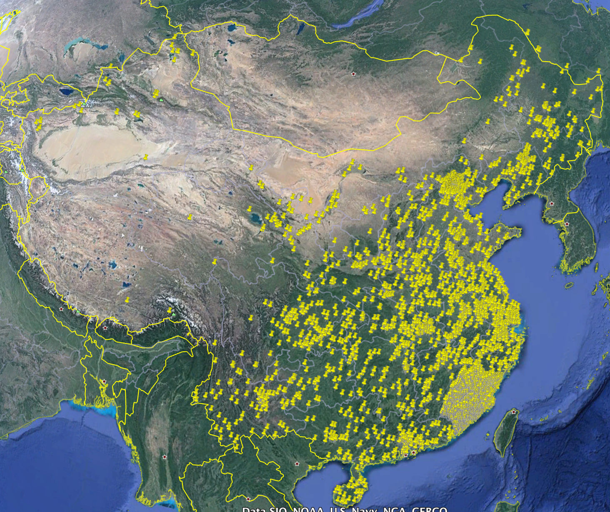
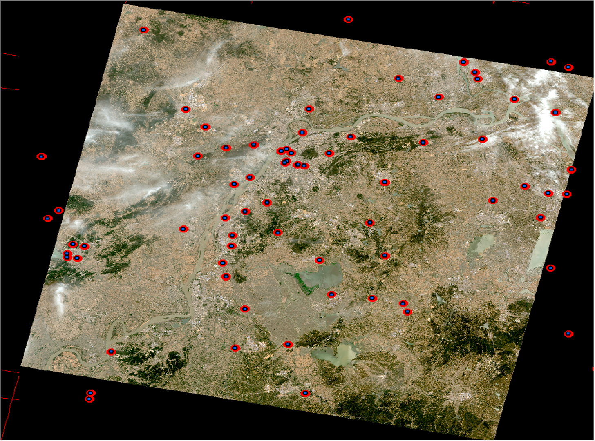
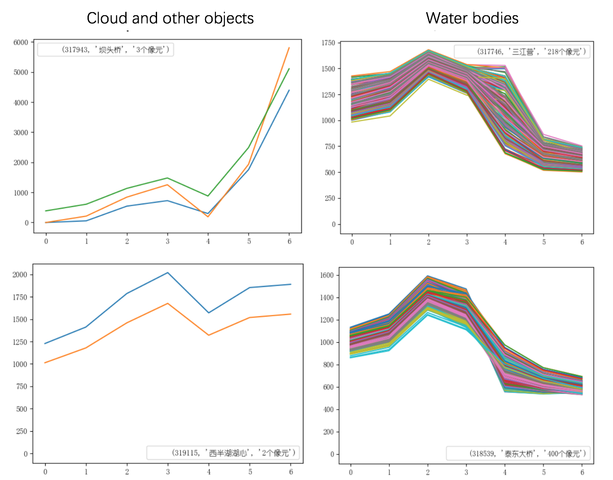
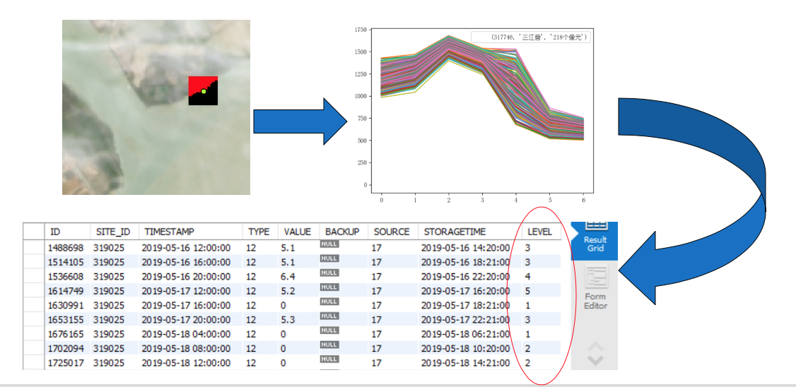

Dataset
===============

Satellite Dataset
-----------------------

Landsat8 OLI has 9 bands with a wavelength ranging from 433 to 1390 nm, respectively.
In the first phase, Landsat8 Operational Land Imager (Landsat8 OLI) images were used in this case study.

13 Landsat-8 scenes around Yangtze river in China were picked up based on shp files intersection.
These scenes from 2019-01-01 to 2019-10-01 were auto-downloaded
from AWS and filtered by the 5% cloud cover for every 16 days.
87 Landsat8 images were finally used in this study,
followed by the radiometric calibration, QUAC and Gram-Schmidt pan-sharpening operations.

Landsat-8 OLI data pre-processing
^^^^^^^^^^^^^^^^^^^^^^^^^^^^^^^^^^^^^^
Radiometric Calibration converts the origin Digital Number (DN) into radiance pixel values or reflectance
with the aim of reducing sensor errors.
https://www.harrisgeospatial.com/docs/RadiometricCalibration.html

Atmospheric Correction converts radiance or surface reflectivity to actual reflectivity on the ground to
eliminate errors caused by atmospheric scattering, absorption, and reflection.

In order to implement auto-processing, the QUCA atmospheric correction method was used.
Experiment shows that compared with Flaash atmospheric correction, the accuracy difference is within 10%.
`reference <../_static/_asset/The_Quick_Atmospheric.pdf>`_.

Pan-sharpening improve spatial resolution to 15m by usage of Gram-Schmidt transformation on the simulated panchromatic band
and the spectral bands.
https://www.harrisgeospatial.com/docs/GramSchmidtSpectralSharpening.html

Here we used self-defined tools to implement pre-processing process.
Another way is to call ENVIPyEngine (Envi version >= 5.4) package to do all the data pre-processing work in python.

Monitoring Site Database
----------------------------
Generally speaking, the lack of reliable labels (ground truth) is the key issue for the classification task of remote sensing images.
Luckily, in this case study, the water quality monitoring system provides sufficient and high-accuracy ground truth data starting from 2019-01-01.
Around 10 water parameter values are being recorded every 4 hours.
Database also provides the water quality levels according to the GB3838-2002 standard.

Although there are total 2796 monitoring sites in China. As shown in the image:

    Monitoring sites

Most of them are installed for monitoring city rivers which can not be recognized by spacial resolution of Landsat8 images.

    Landsat8 image with monitoring sites

The monitoring dataset also contains some invalid or missing values. For example,
due to the sensor malfunction, some water parameter values are 0 even minus.
Or timestamp is not proper-hour distribution. These type of errors are removed and filtered by data cleaning process.
Finally, data from 147 monitoring sites located along Yangtze river and surrounding lakes was used as training inputs.

Samples
-----------------------

NDWI
^^^^^^^^^^^^^^^^^^^^^^^

Water bodies in each image were recognized by improved Normalized Difference Water Index (NDWI).

NDWI = (p(Green)-p(NIR))/(p(Green)+p(NIR))

An experiential value 0.04 was set as threshold to automatically and quickly identify where is water bodies.
However, the constant threshold would misclassify other objects as water which the value of band 3 (Green) is larger than band 5 (NIR).
For example, a monitoring site is surrounded by little cloud (figure upper left).
So, we added extra constrains to results from NDWI.

One was to stipulate the trend of spectral profile.
Typically, the spectral of water has a trend of increasing from band 1 to band 3 or band 4 and then decreasing substantially.
The other was to restrict the range of spectral profile.
The spectral range of water normally fluctuates between 600 and 1500, and is affected by the sensor image quality and
image preprocessing.
After adding these filters, the vast majority of the rest of results were pure water bodies (right part of figure).

Modified NDWI(MNDWI) introduction help to more precisely identify water body area.

Spectral Sample
^^^^^^^^^^^^^^^^^^^^^^^^^^

We assumed that the water quality level within a certain range of the monitoring site is consistent within a certain of time.
Took the daily average of water quality level in database according to the datetime acquired of Landsat-8 data.
A rectangle of 40 pixels around the monitoring station was selected corresponding to the area of 600m x 600m on the ground.
One example of the spectral profile of corresponding pixels around one site station is shown in the figure below.
Our test results showed that the size of the rectangle around each monitoring station had no significant effects on
water-quality-level classification.

Additional features
^^^^^^^^^^^^^^^^^^^^^^^^^^^

Besides origin band 1 to 7 as input features. Some band combination ratios were also included as additional features.

There is high difference of sediment concentration between river and lake.
Sediment concentration is strong correlated with turbidity.
One simple estimation of turbidity is calculated by band combination or band ratio

(p(Red)-p(Green))/(p(Red)+p(Green))

p(Red)/p(Green)

Normalized difference vegetation index (NDVI) is a indicator that can be used to access whether the target
contains green vegetation. It can help model analyse water quality patterns in the water vegetation mix area.

p(NIR)-p(Red)/p(NIR)+p(Red)

Finally, normalized 10 features (7 band features and 3 band combination and ratios) with (40x40x12) size were selected as CNN input.

