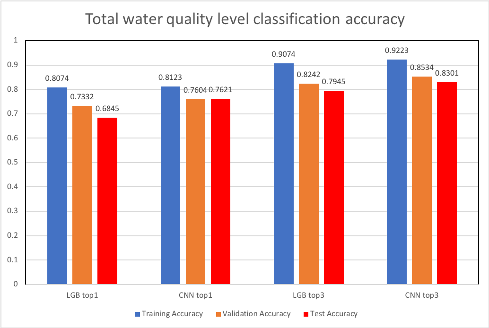
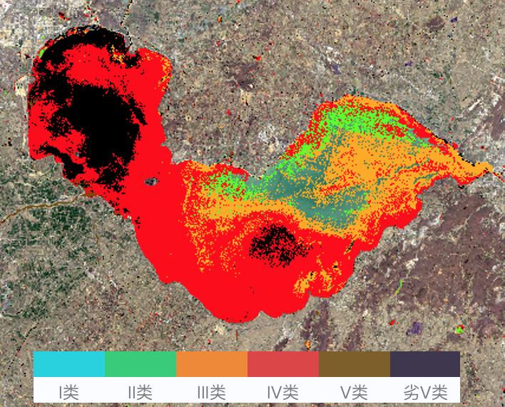
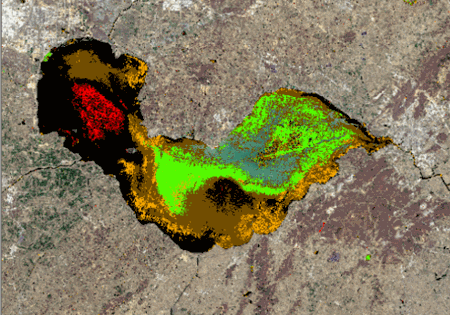
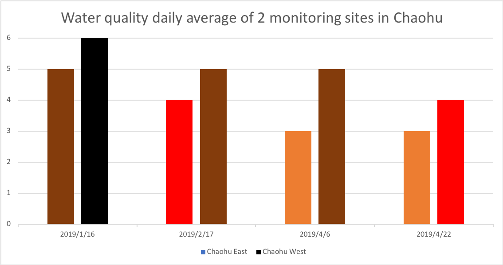
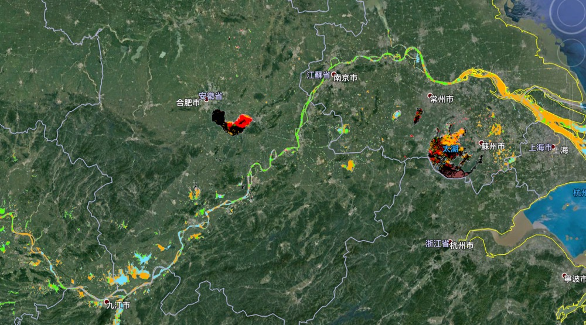
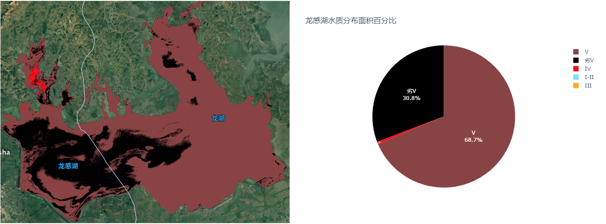

Results
========================

Here we defined a new version of water quality accessing method: top1 and top3 accuracy.

It's the same with normal image classification top1 accuracy which refers to the correctly classified samples divided by the total number of samples.

However different from the top5 accuracy (Among the top five with the largest prediction probability vector, if contains the right class the prediction is correct),
Top3 accuracy is if the predicted class is the right class or its adjacent classes, the prediction is correct.

For example, if true class is II water quality level, top3 contains the predicted class of I, II, III. If true class is
inferior V, top3 includes the predicted class of V, inferior V.

The reason of setting this top3 discipline is that there is very high similarity between adjacent classes.
Two different water quality level may be caused by only 0.1mg/L COD difference.
However, this tiny change will not be reflected in the training data.
Therefore, top3 works like a buffer to distinguish different types of water quality.

Total Accuracy
-------------------

60% of samples were used for training, 30% for validation and 10% for test. The total accuracy is shown bellow:

Overall, CNN model achieved better classification performance than LGB model both in top1 and top3 accuracy
because of the more powerful learning ability of shallow and complex features from multispectral images.

However, due to the indistinguishability of the data itself, both models were easy to stack in overfitting problem.
We attempted to apply many regularization methods (L2, dropout, max_depth in LGB, etc) to reduce the model complexity.
The gap between training and validation accuracy was controlled in a certain range to ensure the model with
generalization ability to some extent.

Chaohu Lake
----------------

Chaohu lake located in Hefei, Anhui Province, is one of China’s five major freshwater lakes. Chaohu Lake has a water surface area of 780 km2,
Industrial and municipal wastewater has contributed to the pollution and eutrophication of Chaohu Lake.
Algal bloom has been broken out in Chaohu for several times.

    2019-04-06 path:120 row:38

According to daily average of Chaohu East site and Chaohu West site on 2019-04-06, the water quality
of east part of Chaohu was III and the west part of Chaohu was V.

The missing part in the east part of image maybe caused by cloud or the misidentify of water bodies of NDWI.
This can be fixed by interpolation post processing.

Furthermore, we can analyse water quality trend of lake with the change over time. As shown in the gif:

    path:120 row:38

The corresponding 4 daily average water quality level of monitoring site is shown in the figure.

The worst pollution area was on the north-western part of Chaohu Lake which locates next to Hefei city.
Hefei’s industry is mainly producing fertilizers, and a large amount of wastewater containing P and N is discharged into the rivers
and finally interflow into north-west of Chaohu Lake.

Downstream of Yangtze River
--------------------------------------------

The Yangtze River is the longest river in China. It originated from QingHai province and
flows through 11 provincial administrative regions.

Continuous high quality Landsat8 images within a certain time range is the key to retrieve water quality in a large range.
We collected 6 landsat8 scenes in downstream of Yangtze river during June 2019 .
As shown in the image:

The water quality of yangtze river was dominated by II and III level. Generally, it had good water quality levels,
benefiting from high water flow and self-purification ability.

Taihu lake located next to two of the most developed cities in China: Wuxi and Suzhou.
It has also suffered from water eutrophication for a long time. A serious Blue algae broke out in 2007.
In recent years, the government is stepping up efforts to purify the water quality of Taihu Lake.
But the results are not sufficient, and the water quality of Taihu Lake is still not optimistic.

Quantitative Analysis
--------------------------
If the border of a lake or a river is determined, then we can do the quantitative analysis.
Such as the area and percentage of different water quality.
The analysis report can be used as a reference for the pollution source tracking and control.

