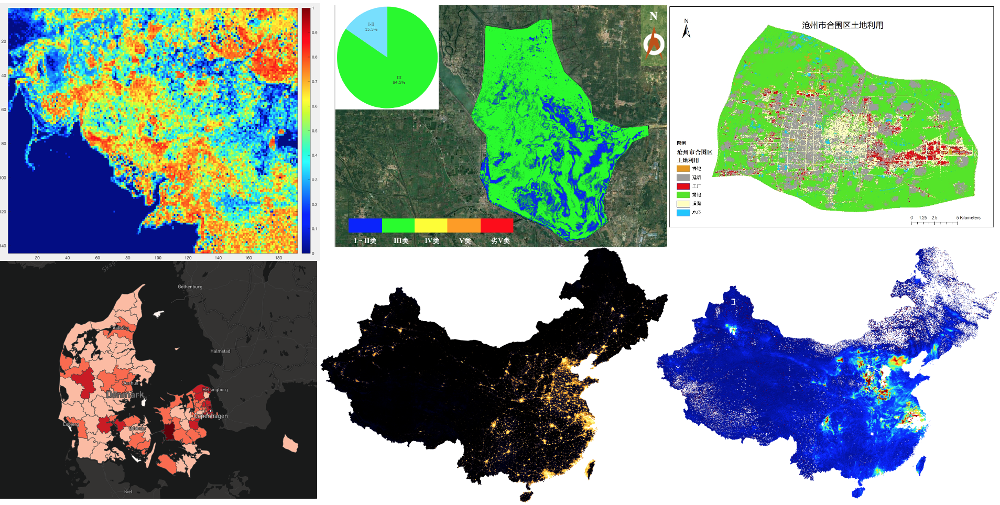

========================================================
Welcome to Siyu Liu's Projects Presentation!!!
========================================================

Welcome! Velkommen！

This is Siyu Liu.

I am currently a remote sensing engineer, focusing on the interpretation and processing of remote sensing images.
I wrote this documentation to introduce the projects I have ever done or participated in.

.. warning:: Lots of figures are involved to show some results intuitively. It may load slightly slow, please be patient.

.. csv-table:: Project Table
   :header: "Project", "Category","Duration", "Tasks",  "Situation"
   :widths: 25, 10, 10, 20, 10

   Sea Ice Concentration Retrieval,Image/Data Regression,2018/01-2018/07,Full of Charge,Finished
   Water Quality Retrieval,Image Classification,2019/11-now,Full of Charge,Improving
   Land Use Classification,Image Classification,2020/03-now,Full of Charge,Developing
   Visualization of Remote Sensing Data,Image Visualization,Long-term,Participate,Continually updated

.. toctree::
   :maxdepth: 2
   :caption: Index

   content/SIC/index
   content/WQR/index
   content/LUC/index
   content/RIV/index

Version
=============
*Current：v0.1*

.. csv-table:: 
   :header: "Version", "Release Time",  "Author"
   :widths: 20, 20, 20

   v0.1,"2020-05-28","Siyu Liu"

.. note:: The rules of version number follow ``major.minor``.

          1. An update of the major version number indicates an increase of new product type.
          #. An update of the minor version number indicates that some content has been changed.

See the specific change records of each version
:doc:`VersionLog <content/CHANGELOG/index>`
